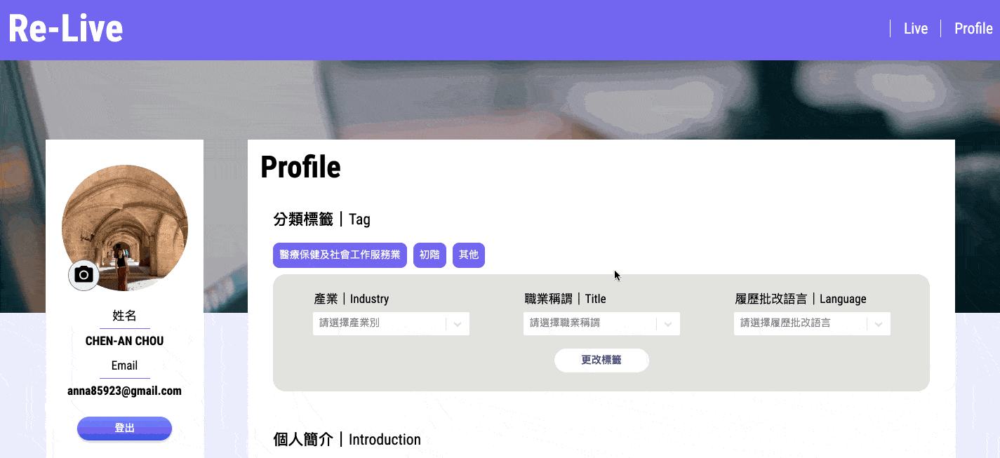
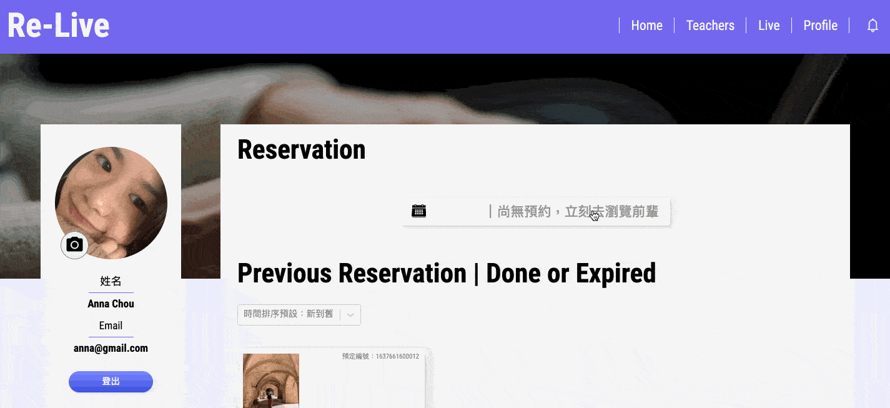
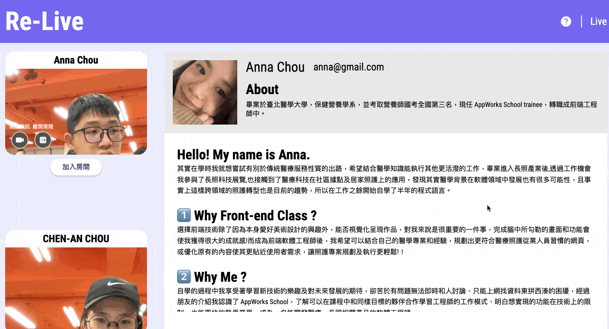

<h1 align="center">Re-Live</h1>

## Introduction

#### Re-Live is an online resume editor and real-time video chat website with two user roles.

> As a teacher

- You can create your personal profile and manage calendar grid to schedule each appointment.
- Launching a 1-to-1 video chat with students, discussing and revising their resumes at the same time.

> As a student

- You can create a customized resume and print it out.
- Browsing or filtering the teacher lists by industry that you're interested in.
- Making appointments and video conferencing with teachers for enhancing resume writing and interviewing skills.

## Demo Link

> #### [Re-Live Website](https://re-live-resume-your-life.web.app/)

Please choose your roles and signin with your account for full experiences.

## Technologies

#### Front-End

- React / Redux / React Router
- styled-components
- Firebase service
  - Authentication
  - Firestore Database
  - Storage
  - Hosting
  - Function
- WebRTC API

#### Miscellaneous

- react-quill
- react-html-parser
- react-easy-edit
- react-datepicker
- react-joyride
- react-select
- sweetalert2
- nanoid

## Flow Chart

## Features

> As a teacher

- #### Edit your personal profile.
  
- #### Handle schedule by adding or removing available time to calendar grid.
  
- #### Check each student's reservation and their resume.
  

> As a student

- #### Create a customized resume and print it out.
  
- #### Can't find the teachers that you're interested in? Filter them out!
  
- #### Browse through the comments and make an appointment.
  

> Live Room

- #### Teacher ｜ It's time for video chat! Send invitation to student!
  
- #### Student ｜ Notification received, join room!
  
- #### Discussing and revising resumes at the same time.
<table>
  <tr>
    <td valign="top"></td>
    <td valign="top"></td>
  </tr>
</table>
<!--  -->

<!-- - #### Contribute your recipe to the community. -->
  <!--  -->

- #### Student ｜ Let teacher knows what's on your mind!
  
