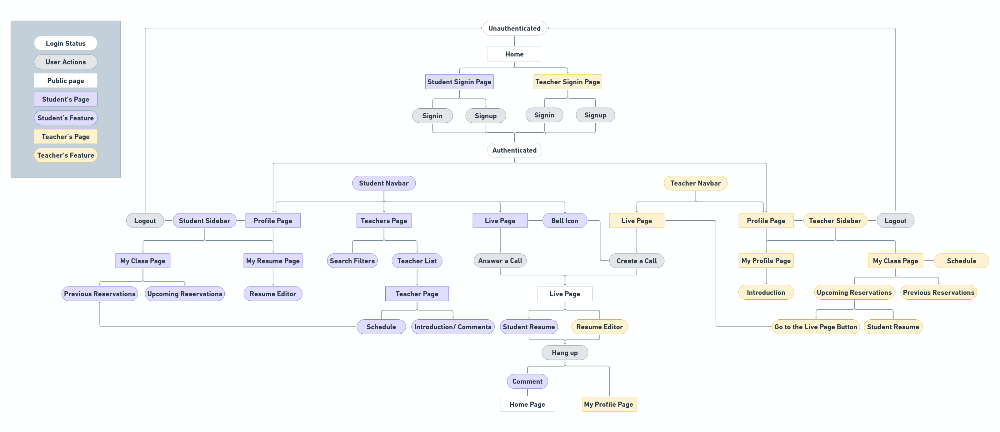

## Introduction

#### Re-Live is an online resume editor and real-time video chat website with two user roles.

> ### As a teacher

- You can create your personal profile and manage calendar grid for each appointment.
- Launch a 1-to-1 video chat with student to discuss and revise their resumes online immediately.

> ### As a student

- You can create a customized resume and print it out.
- Browse or filter the teacher list by industry that you're interested in.
- Make appointments and video conferencing with teachers to enhance resume writing and interviewing skills.

## Demo Link

> ### [Re-Live Website](https://re-live-resume-your-life.web.app/)

#### Please choose your role and signin with your account for full experiences.

#### Test account is also availible below.

- #### Teacher

  - Account: teacher_relive@relive.com
  - Password: relive

- #### Student
  - Account: student_relive@relive.com
  - Password: relive

## Technologies

#### Front-End

- React / Redux / React Router
- styled-components
- Firebase service
  - Authentication
  - Firestore Database
  - Storage
  - Hosting
  - Function
- WebRTC API

#### Miscellaneous

- react-quill
- react-html-parser
- react-easy-edit
- react-datepicker
- react-joyride
- react-select
- sweetalert2
- nanoid

## Flow Chart

## Features

> ### As a teacher

- #### Handle schedule by adding or removing available time to calendar grid.
  
- #### Check each student's reservation and their resume.
  

> ### As a student

- #### Create a customized resume and print it out.
  
- #### Filter the teachers that you're interested in and make an appointment.
  

> ### Live Room

- #### Teacher ｜ It's time for video chat! Send invitation to student!
  
- #### Student ｜ Notification received, join room!
  
- #### Now you can discuss and revise resume in real time.
  

## Future Features

- Provide more resume templates and design feature for better customized editing experience.
- Add classification feature to manage each reservation.
- Raise the built-in live stream service from a maximum of 10 people to 50 people temporarily.
- Create real-time chat room for easier communicating with other users.

## Contact Me

If you got any problem or suggestion with Re-Live, please feel free to contact with me via email.

Author: CHEN-AN, CHOU
Email: anna85923@gmail.com
